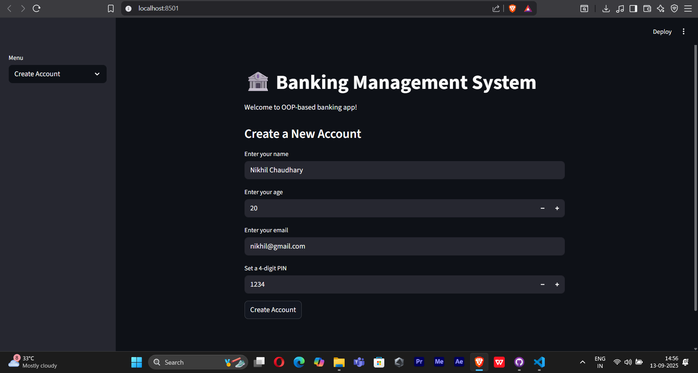

# 🏦 Banking Management System – OOP + Streamlit  

## 📌 Project Overview  
This project is a **Banking Management System** built in **Python (OOP principles)** and deployed as a **Streamlit web app**.  
It simulates a simple banking system where users can:  
- Create an account  
- Deposit / Withdraw money  
- View account details  
- Update email or PIN  
- Delete account  

All data is stored in a **JSON file**, ensuring persistence across sessions.  

---

## 🚀 Features  
✅ Account creation with auto-generated account number  
✅ Deposit & Withdraw money with validations  
✅ Update account details (email, PIN)  
✅ Delete account permanently  
✅ JSON-based storage (persistent data)  
✅ Interactive **Streamlit web interface**  

---

## 🛠️ Tech Stack  
- **Python 3**  
- **Object Oriented Programming (OOP)**  
- **Streamlit** (for UI)  
- **JSON** (for data storage)  

---

## 📷 Screenshots  


---

## 📂 Project Structure  
```
Banking-Management-System/
│── BankApp.py          # Main Streamlit app
│── data.json           # JSON file for storing accounts
│── requirements.txt    # Project dependencies
│── README.md           # Project documentation
```

---

## 📖 Learning Outcomes  
Through this project I learned:  
- Applying **OOP principles** in real projects  
- File handling with **JSON**  
- Creating interactive UIs with **Streamlit**  
- Building a **menu-driven system** that feels like real banking software  

---

## 👨‍💻 Author  
**Nikhil Chaudhary**  
🔗 [LinkedIn](www.linkedin.com/in/nikhil-chaudhary-69145932b) | [GitHub](https://github.com/nikkhil2004)  
